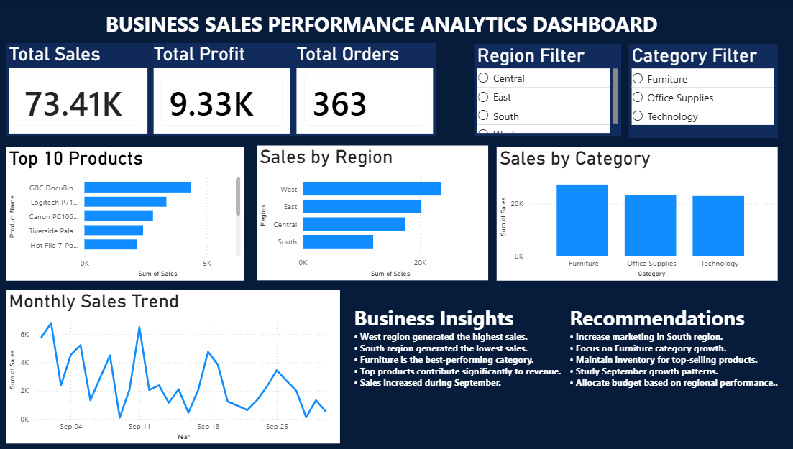

# Business Sales Performance Analytics

## Project Overview
This project analyzes sales data to identify revenue trends, category performance, regional performance, and top-selling products.

## Tools Used
- Python
- Pandas
- Matplotlib
- Power BI

## Key KPIs
- Total Sales
- Total Profit
- Total Orders

## Dashboard Features
- Sales by Region
- Sales by Category
- Monthly Sales Trend
- Top Products Analysis
- Interactive Filters

## Business Insights
- West region generated the highest sales.
- South region showed the lowest sales.
- Furniture was the highest-performing category.
- Top products contributed significantly to revenue.
- Sales increased during September.

## Recommendations
- Improve marketing in low-performing regions.
- Focus on high-performing products.
- Optimize inventory planning.
- Use trend analysis for forecasting.

## Dashboard Preview

